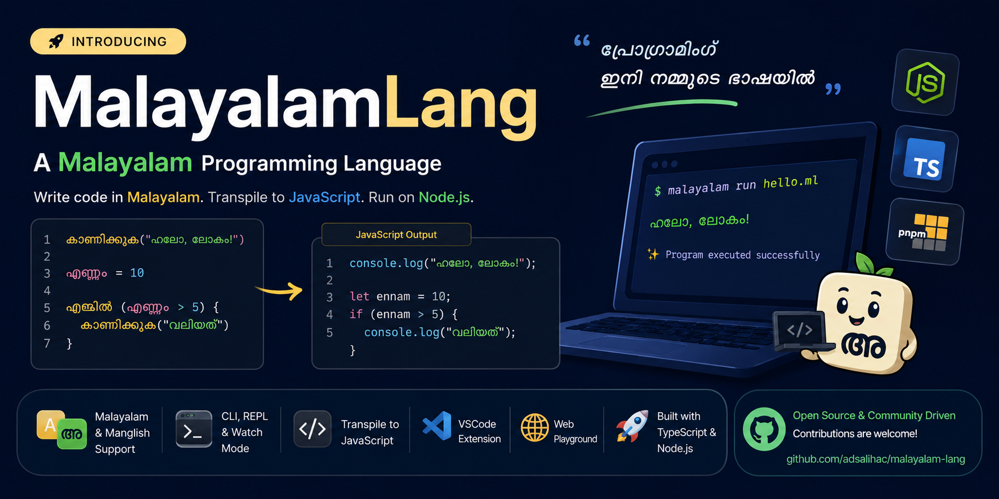

A modern, beginner-friendly programming language where you write code using Malayalam keywords! 🇮🇳

```ml
കാണിക്കുക("ഹലോ, ലോകം!")
```

Translate to JavaScript and runs on Node.js.

## Features

- 🇮🇳 **Malayalam Syntax**: Write code using Malayalam Unicode and Manglish
- 🚀 **Fast Compilation**: Transpile to JavaScript instantly
- 🎯 **Beginner-Friendly**: Clear error messages, easy syntax
- 🔧 **Full Tooling**: CLI, REPL, VSCode extension
- 📦 **Node.js Integration**: Run directly on Node.js
- 🌐 **Monorepo Architecture**: Clean, modular, scalable

## Quick Start

### Installation

```bash
npm install -g @malayalamlang/cli
```

### Hello World

Create `hello.ml`:

```ml
കാണിക്കുക("ഹലോ, ലോകം!")
```

Run it:

```bash
malayalam run hello.ml
```

### Using Manglish

```ml
kanikkuka("Namaskaram!")
```

## CLI Commands

```bash
# Run a Malayalam script
malayalam run script.ml

# Compile to JavaScript
malayalam compile script.ml

# Interactive REPL
malayalam repl

# Watch mode
malayalam watch script.ml
```

## Language Syntax

### Variables

```ml
എണ്ണം = 42
പേര് = "മലയാളം"
```

Manglish:

```ml
ennam = 42
pera = "malayalam"
```

### Functions

```ml
ഫങ്ക്ഷൻ ചതുരം(x) {
  മടങ്ങി x * x
}

കാണിക്കുക(ചതുരം(5))
```

### Conditionals

```ml
എണ്ണം = 15

എങ്കിൽ (എണ്ണം > 10) {
  കാണിക്കുക("വലിയത്")
} അല്ലെങ്കിൽ {
  കാണിക്കുക("ചെറിയത്")
}
```

### Loops

```ml
എന്ത് (i = 0; i < 5; i = i + 1) {
  കാണിക്കുക(i)
}
```

## Project Structure

```
apps/
├── playground/        # Interactive web playground
packages/
├── core/              # Compiler & transpiler
├── runtime/           # Built-in functions
├── cli/               # Command-line interface
└── vscode-extension/  # VSCode language support
```

## IDE & Tools

### VSCode Extension

- 🎨 Syntax highlighting for Malayalam and Manglish
- 💡 IntelliSense & code completion
- 🐛 Real-time diagnostics
- ⚡ Go to definition & find references

Install from VS Code Marketplace:

- 🔗 <https://marketplace.visualstudio.com/items?itemName=MalayalamLang.malayalam-language>
- 📦 Extension ID: `MalayalamLang.malayalam-language`

Install via command line:

```bash
code --install-extension MalayalamLang.malayalam-language
```

### Web Playground

- 🌐 Write and run code in your browser
- 📝 Built-in examples & tutorials
- 🚀 No installation required
- 👥 Share and collaborate

## Examples

### Factorial

```ml
ഫങ്ക്ഷൻ factorial(n) {
  എങ്കിൽ (n <= 1) {
    മടങ്ങി 1
  }
  മടങ്ങി n * factorial(n - 1)
}

കാണിക്കുക(factorial(5))
```

### Fibonacci

```ml
ഫങ്ക്ഷൻ fib(n) {
  എങ്കിൽ (n <= 1) {
    മടങ്ങി n
  }
  മടങ്ങി fib(n - 1) + fib(n - 2)
}

എന്ത് (i = 0; i < 10; i = i + 1) {
  കാണിക്കുക(fib(i))
}
```

## Compiler Architecture

```
Source Code (Malayalam)
    ↓
Lexer (Tokenizer)
    ↓
Parser (Chevrotain)
    ↓
AST (Abstract Syntax Tree)
    ↓
Transpiler (to JavaScript)
    ↓
JavaScript Output
    ↓
Node.js Runtime
```

## Development

### Setup

```bash
# Install pnpm (faster package manager)
npm install -g pnpm

# Install dependencies
pnpm install

# Build all packages
pnpm build

# Run tests
pnpm test

# Run linter
pnpm lint

# Format code
pnpm format
```

### Contributing

See [CONTRIBUTING.md](./CONTRIBUTING.md)

## Documentation

- [Language Syntax Guide](./docs/SYNTAX.md)
- [CLI Usage](./docs/CLI.md)
- [Architecture](./docs/ARCHITECTURE.md)
- [Contributing Guide](./CONTRIBUTING.md)

## Examples

See the [examples/](./examples/) directory for complete programs.

## Support

- 📚 [Documentation](./docs)
- 🐛 [Issue Tracker](https://github.com/adsalihac/malayalam-lang/issues)
- 💬 [Discussions](https://github.com/adsalihac/malayalam-lang/discussions)
- ▶️ [Live Playground](https://malayalam-lang-playground.vercel.app/?utm_source=chatgpt.com)
- 🧩 [VS Code Extension](https://marketplace.visualstudio.com/items?itemName=MalayalamLang.malayalam-language)

## License

MIT © MalayalamLang Contributors

## Acknowledgments

Built with ❤️ for the Malayalam developer community.
